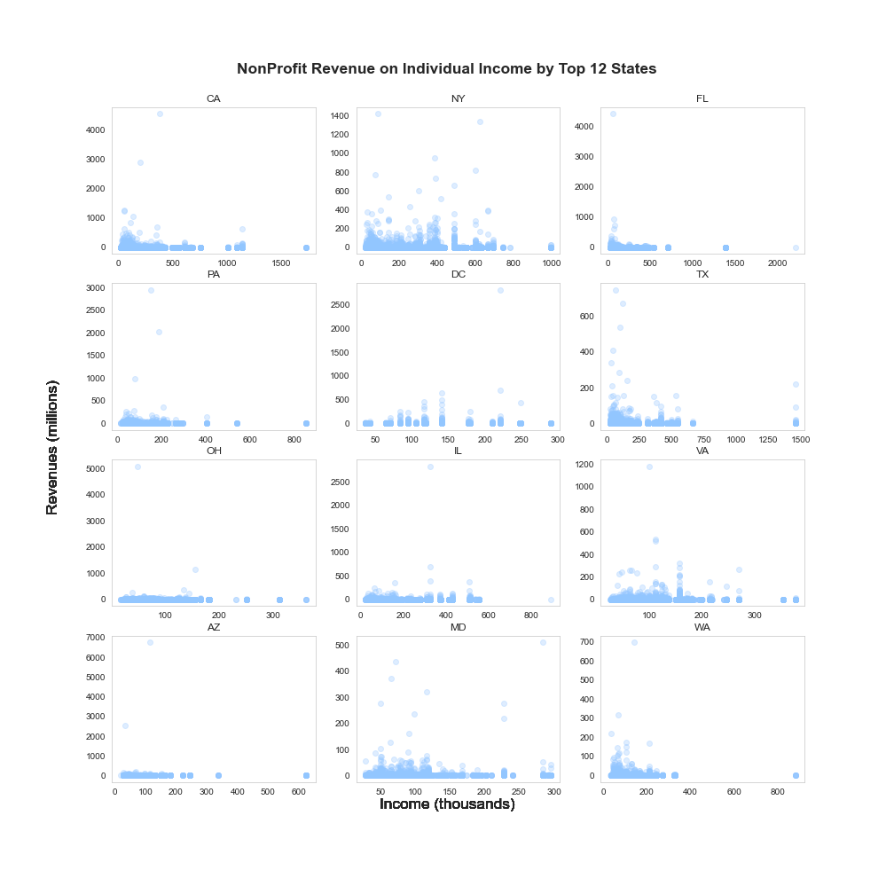

<h1>  Change Unlimited </h1>

##### TL;DR
#### Analysis: Are revenues for non-profit organizations impacted by household income?
**H0:** mean of NPs’ revenue ***are the same*** in lower & upper-half of mean household income.  
**HA:** mean of NPs’ revenue ***are NOT the same*** in lower & upper-half of mean household income.

### Summary
---
The goal for this analysis was to identify regions of interest within the United States that would benefit from Change Unlimited's fundraising platform, helping focus business resources on enhancing social impact. 

Non-profit organizations spend an excessive amount of resources harvesting busienss relationships, many times at the expense  of driving real impact. One can make the argument that raising funds allows for increased impact, and although true, a platform that has reach and scale for donors and fundraisers  allows for both, increased revenues and increased impact. 

This is **Change Unlimited's** objective. 

### Background & Inspiration
---

With a background in finance and wealth management, I always carry a deep personal interest in understanding how money impacts decision making across busnesses and individuals. Money/Finance is one of the few instruments in life which is found in every human interaction, practically tied into time. 

Constinently carrying this view, I look for ways to apply different analysis in areas that I don't fully understand. Shortly after moving to Austin, TX I met Change Unlimited's Founder, a startup looking to change the way non-profit organizations fundraise. As a default skeptic of non-profit organizations, I had many questions. 

My skepticism stems mainly from the mismanagement of funds and the difficulty to measure the true social impact an organization makes. Having these doubts, Change Unlimited kindly allowed me to analyze the organzations data and help develop ideas on possible paths forward.

#### Analysis: Are revenues for non-profit organizations impacted by household income?

## Hypothesis
The first question to understand was very high level. Having little domain knowdlege of the non-profit industry, I started at a point that is most familiar, money/finance. Hoping to uncover more questions than answers, the data definitely did not disappoint. 

**H0:** mean of NPs’ revenue ***are the same*** in lower & upper-half of mean household income.  
**HA:** mean of NPs’ revenue ***are NOT the same*** in lower & upper-half of mean household income.

The t-test was conducted on revenues between the NPs operating in areas below the mean household income and those above the mean household income. Considering this was an initial dive, not having many biases going into this project, and understand the realities of distribution of income, alpha was set to .10. This increased the chances of observing Type I errors.

## Data

There were three sources of information, data directly from Change Unlimited, income and nonprofit data from www.irs.gov, and demographic and income data from www.census.gov. 

Change Unlimited's data was mainly pre-structured and formatted, same as IRS data, the information existed as csv files. 
* individual income reported to IRS 
* all non-profit orgs registered in US, with financial data

Census data required connecting to the site via API and pulling in the information necessary to run my test. 
* mean household income by city and state, also pulled in additional information such as, age, sex, employment status, and industry worked.

## Exploratory Data Analysis

Here we finally dive into the data we've gathered. The original dataset from Change Unlimited and the IRS of non-profit orgs registered, within US, was appx 1.7M. The IRS dataset for individual incomes included ~166K datapoints, while the census data pulled included demographic information for 630 US cities.

In order to merge data, we needed to establish the mean income within the area a nonprofit operates in. We did this by cross validating the information we attained from IRS income and census data and assigning each non-profit's zip code with a mean HH income. Subsequently, we need to ensure that we were not skewing the data by the thousands of reported non-profits that were not operating, to accomplish this we only analyzed the organizations that reported revenues larger than $0. Then, we merged the tables between income and non-profit orgs, dropping any areas in the US that did not have a reported mean income within our IRS/Census data. 

These steps brought our scope from ~1.7M to ~410K organizations. 

Following this step we began some preliminary graphs to visually identify any points of interest that may be worth inspecting. 

#### How are organizations distributed across the US? Which states account for what portion of NP and revenues?

**Actionable thoughts:** 
* What's going on in Oregon? Low number of orgs massive jump in revenues.  
* Why the big difference between the top states? Immediate intutition, most expensive states to live in, what kind of nps are shown here?.

#### What does a scatter of revenues on income look like? Any indications of correlation?

images/rev_on_inc_scatter2.png
**Actionable thoughts:** 
* No clear sign of correlation, strong density concentrations on lower left sides of scatter. Zoom into NPs at lower range of revenues?
* Original scatters had issues representing relationship due to wide range of revenues, updated scatter 

##thought see if there is any relationship between revennues and area of impact/reach of organzation. 

# Data
----------
www.irs.gov  
www.census.gov  
https://www.consumerfinance.gov  
